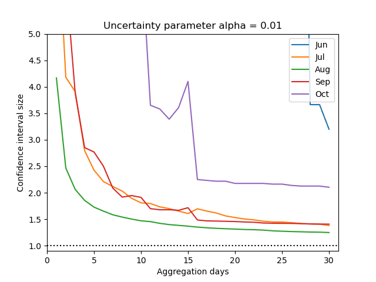

# Turtles_Covid
 
Interactive graphs are available at [Binder](https://mybinder.org/v2/gh/sadda/Turtles_Covid/HEAD?labpath=notebooks%2Fexample.ipynb) (loading may take few seconds).

Our results depend on the number of detected entries (denoted by detected viewing pressure). When we consider these entries daily, there is usually a small number of them, which leads to large uncertainty. The users may therefore to make predictions over aggregated windows (such as weekly or even monthly).

The following animation shows the aggregation window size influences the width of the confidence interval. When we consider daily entries (the size of the aggregation window is one), the estimated ratio of the real viewing pressure is often above one (which would mean that there was higher real viewing pressure in 2020 than in 2019). However, in all these cases, the confidence interval is large (and therefore the uncertainty in results is large). However, when we increase the size of the aggregation window, the number of entries in each window increases and the confidence interval becomes more reliable (its width is small).

The following animation complements the previous one. We fix the size of the aggregation window and discretize each month into aggregation windows (for example, when the aggegation window is 4 days, a month with 30 days is split into 7 aggregation windows and 2 days are ignored). For each month we then compute the average width of the confidence interval. It is not surprising that the summer months (with a large number of entries) have smaller average width. At the same time, the width decreases with increasing size of the aggregation window. The animation showsthe dependence on the allowed level of error alpha (usually considered as 1 or 5 per cent). When the allowed error increases, the the width of the confidence interval decreases.

Our results use two sets of assumptions. The first set relates to the derivation of the model, while the second set relates to the computation of the confidence interval. The following animation shows that the second set of assumptions is correct. We fixed several parameters and compared the true confidence interval with our result. The animation shows that there is a very good overlay for almost all parameters. 

