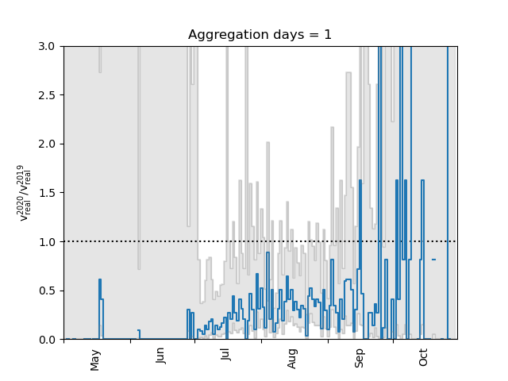
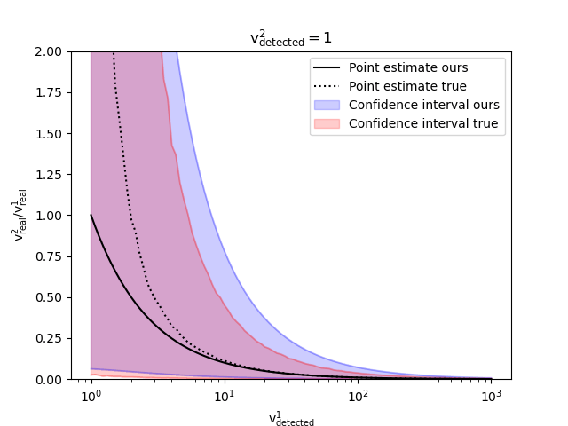
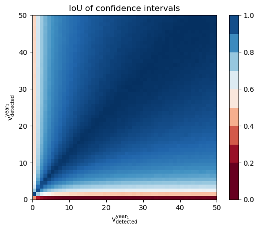

# A social media-based framework for quantifying temporal changes to wildlife viewing intensity
 
This repo contains supplementary material to the [paper](https://www.biorxiv.org/content/10.1101/2022.05.19.492636) "A social media-based framework for quantifying temporal changes to wildlife viewing intensity: Case study of sea turtles before and during COVID-19". Interactive graphs are available at [Binder](https://mybinder.org/v2/gh/sadda/Turtles_Covid/HEAD?labpath=notebooks%2Fexample.ipynb) (loading may take few seconds).

 
## Summary

The paper quantifies *real viewing pressure*, which we define as the number of encounters between an animal and a human. Since this quantity is impossible to observe, we estimate it based on the *observed viewing pressure*, which we define as number of entries uploaded on a social media (Instagram) with appropriate hashtags. Our method does not estimate the precise value but the ratio in two periods (such as subsequent years).

## Usage

We assume the user to obtain the observed viewing pressures `v1` and `v2`  in the two investigated periods. To compute the ratio of the real viewing pressures, we call function `compute_confidence`.

```
import sys
sys.path.insert(0, '../src')
import numpy as np
from confidence import compute_confidence

v1 = np.arange(1, 101)
v2 = np.arange(1, 101)
point, lb, ub = compute_confidence(v1, v2)
```

The following code plots the point estimate and its confidence interval. Since `v1` equals to `v2` by its definition, the point estimate is always 1. The size of the confidence interval decreases with the increasing number of observations. This makes sense as more data imply a more reliable model.

```
import matplotlib.pyplot as plt

plt.plot(v1, point, label='Point estimate')
plt.plot(v1, lb, color="grey", alpha=0.2, label='_nolegend_')
plt.plot(v1, ub, color="grey", alpha=0.2, label='_nolegend_')
plt.fill_between(v1, lb, ub, color="grey", alpha=0.2, label='Confidence interval')
plt.xlim(1, 100)
plt.ylim(0, 3)
plt.xlabel('$\mathrm{v}_{\mathrm{detected}}^{1} = \mathrm{v}_{\mathrm{detected}}^{2}$')
plt.ylabel('Ratio of real viewing pressure')
plt.legend()
```


## Additional interactive plots

Our results depend on the number of detected entries (denoted by detected viewing pressure). When we consider these entries daily, there is usually a small number of them, which leads to large uncertainty. The users may therefore to make predictions over aggregated windows (such as weekly or even monthly).

The following animation shows the aggregation window size influences the width of the confidence interval. When we consider daily entries (the size of the aggregation window is one), the estimated ratio of the real viewing pressure is often above one (which would mean that there was higher real viewing pressure in 2020 than in 2019). However, in all these cases, the confidence interval is large (and therefore the uncertainty in results is large). However, when we increase the size of the aggregation window, the number of entries in each window increases and the confidence interval becomes more reliable (its width is small).




Our results use two sets of assumptions. The first set relates to the derivation of the model, while the second set relates to the computation of the confidence interval. The following animation shows that the second set of assumptions is correct. We fixed several parameters and compared the true confidence interval with our results when the detected viewing pressure ranges from 10 to 1000. The animation shows that there is a very good overlay for almost all parameters. 


One of the drawbacks of our method is the situation when the detected viewing pressure is low. The next animation shows how the confidence intervals behaves when we vary the detected viewing pressure v1 between 1 and 1000. Each frame fixes the other detected viewing pressure v2 between 1 and 10. We see that the results are satisfactory whenever one of the detected viewing pressures is "large".




To quantify what "large" means, we plot the intersection over union (IoU) between the true and our confidence intervals. IoU is a standard machine learning metric which computes how the intervals and overlapped, one means a perfect overlap while zero means no overlap. The following graph shows how IoU changes for different values of v1 and v2. We see that we obtain good saisfactory results whenever both of these values are larger at least five. 


